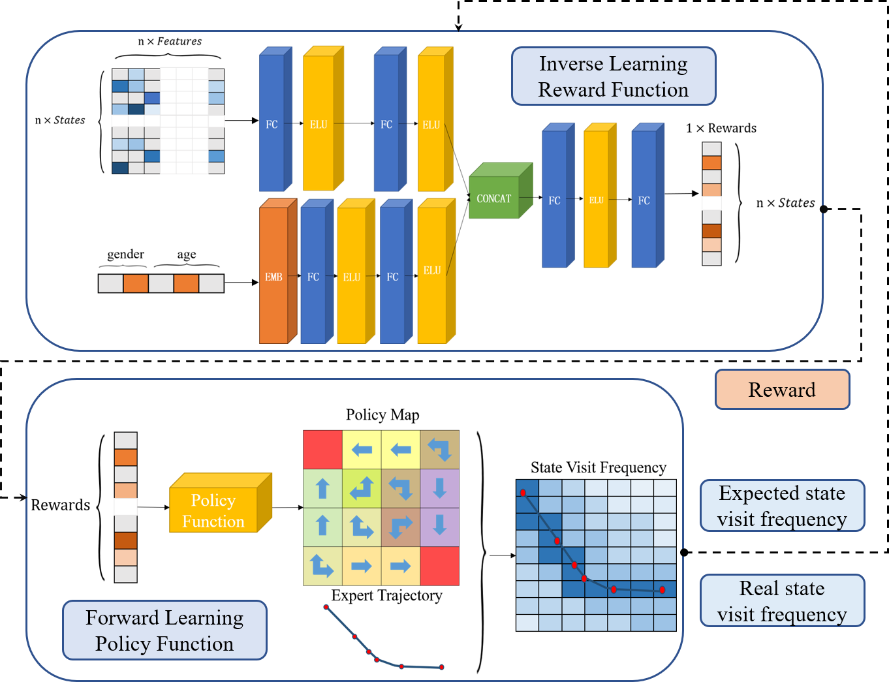
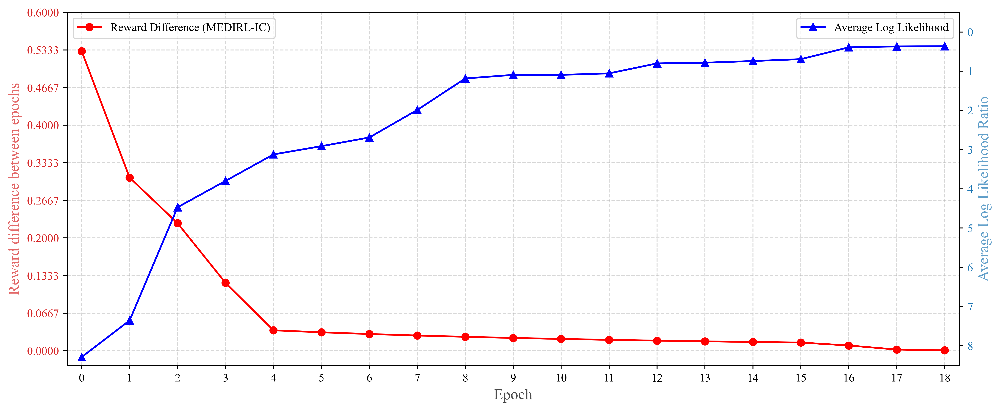
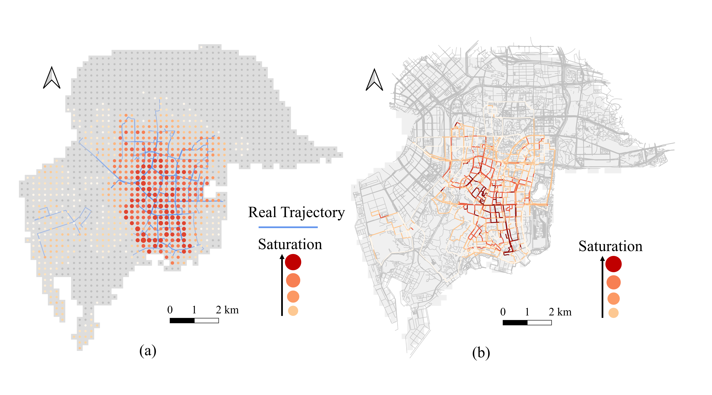
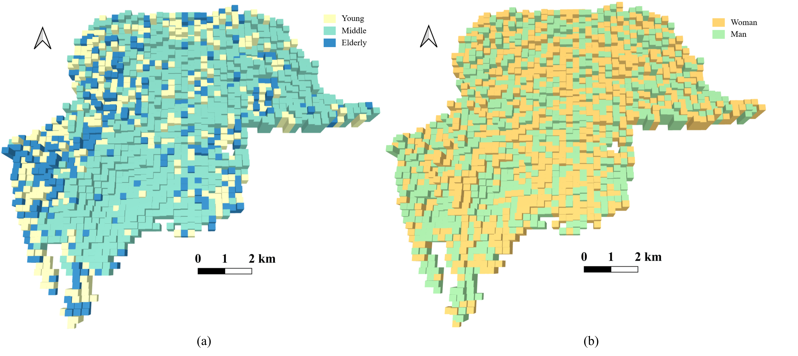
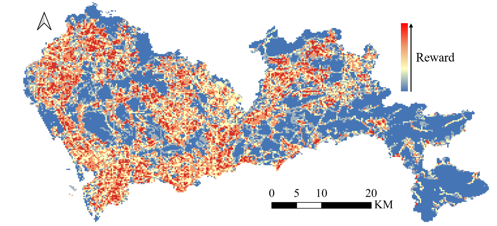
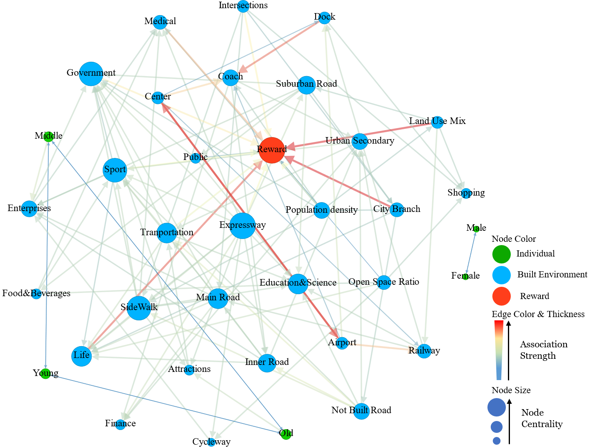

# MEDIRL-IC

## Atricle
**Enhancing Pedestrian Route Choice Models through Maximum-Entropy Deep Inverse Reinforcement Learning with Individual Covariates (MEDIRL-IC)**: This article is currently under review. Updates will be provided upon completion of the peer-review process.

## Introduction

This project is a collection of algorithms and models dedicated to "Deep Inverse Reinforcement Learning with Individual Covariates" in the context of pedestrian route choice. Developed by Boyang Li at SUPD, Peking University.

## Directory Structure

- **A_star**: Implementation of the A* algorithm.
- **DTW**: Initial setup and configurations for DTW (Dynamic Time Warping).
- **data**: Contains datasets, data preprocessing scripts, and other data-related utilities.
- **model**: Stores model parameters and configuration files.
- **plot**: Scripts for generating visualizations and related plots.
- **realGrid**: Urban grid classes and methods representing real-world scenarios.
- **img**: Images utilized primarily for the project's README documentation.

### Configuration and Utility Files

- `.gitignore`: Configuration file for Git to determine which files and directories to ignore before committing.
- `README.md`: Provides an overview and documentation for the project.
- `img_utils.py`: Utility functions related to image processing.
- `tf_utils.py`: Utility functions related to TensorFlow operations.
- `utils.py`: General utility functions for the project.

### Causal Analysis

- `causal_data.py`: Script for handling causal data.
- `causal_learn_pc_detailed.py`: Detailed learning scripts for the PC algorithm in causal inference.
- `causal_plot_detailed.ipynb`: Jupyter notebook for detailed plotting and visualization of causal data.

### Deep Inverse Reinforcement Learning (IRL)

- `deep_irl_be.py`: Deep IRL only considered built environment.
- `deep_irl_realworld.py`: Implementation of deep IRL with IC for real-world scenarios.
- `demo_deepirl_be.py`: Demonstration script for deep IRL backend.
- `demo_deepirl_realworld.py`: Demonstration script for deep IRL with IC in real-world scenarios.

### Recursive Logit Model

- `demo_recursive_logit.py`: Demonstration script for the recursive logit model.
- `recursive_logit.py`: Implementation of the recursive logit model.
- `test_recursive_logit.py`: Testing script for the recursive logit model.

### DNN-PSL Model

- `dnn_psl.py`: Script related to the deep neural network model.
- `test_dnn_psl.py`: Testing script for the DNN model.

### Trajectory Evaluation and Analysis

- `evaluate_traj_IRL.py`: Evaluation scripts for IRL trajectories.
- `evaluate_traj_psl.py`: Evaluation scripts for PSL trajectories.
- `traj_contrast.py`: Scripts for trajectory contrast analysis.
- `traj_contrast_psl.py`: Scripts for PSL trajectory contrast analysis.
- `traj_policy_logll.py`: Scripts related to policy log likelihood for trajectories.
- `trajectory.ipynb`: Jupyter notebook for trajectory functions.
- `trajectory.py`: Scripts related to trajectory functions.

### Miscellaneous

- `nshortest_path.ipynb`: Jupyter notebook related to the choice set of path-size logit model.
  
## Getting Started

1. Clone the repository.
2. Install necessary dependencies.
3. Run the desired scripts or models.

## Dependencies

- **Fiona**: 1.8.13
- **GDAL**: 3.0.4
- **geopandas**: 0.8.2
- **matplotlib**: 3.0.3
- **networkx**: 2.4
- **numpy**: 1.14.5+mkl
- **pandas**: 0.25.3
- **pyproj**: 2.5.0
- **Rtree**: 0.9.3
- **scipy**: 1.4.1
- **seaborn**: 0.9.1
- **Shapely**: 1.6.4.post2
- **tensorflow**: 0.12.1

## Data Availability

Due to individual privacy concerns, we only provide geographical data for the training region along with a limited set of encrypted individual trajectory data.

## Results and Visualizations

### DeepIRL

### Box Comparison

### Reward and Likelihood Plot

### Dynamic Traffic Equilibrium

### Reward Map based on IC

### SZ Reward Map

### Causal Directed Graph

### Causal Strength

## License and Credits

This project is licensed under the MIT License - see the [LICENSE](LICENSE) file for details.